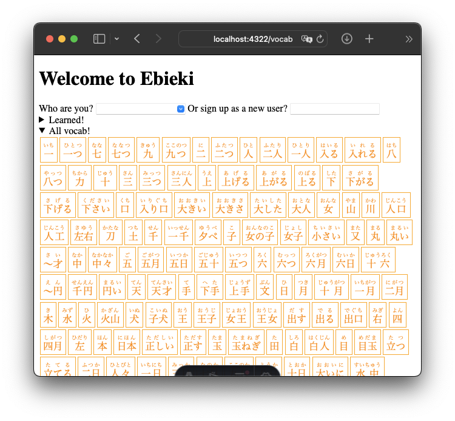
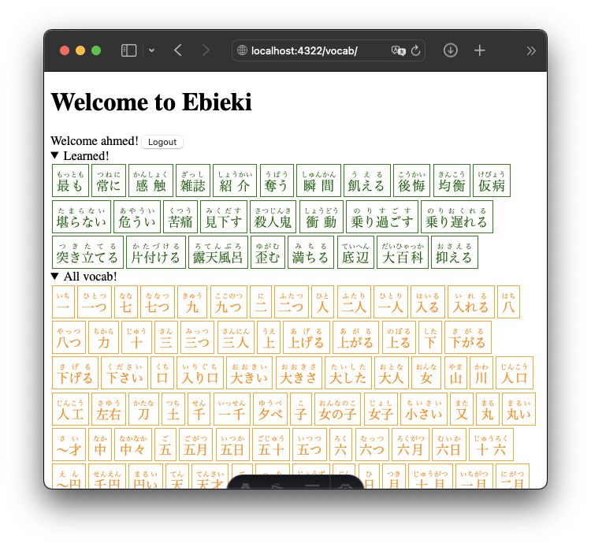

# Ebi-Eki Platform 1

This is an experimental web app intended to learn [Wanikani](https://www.wanikani.com) vocabulary (see https://github.com/fasiha/ebieki for the data set: Wanikani vocabuary with public JMdict definitions).

It's very rough and more of a proof of concept. To set it up, you need to
1. install [Node.js](https://nodejs.org) and [Git](https://git-scm.com).
2. Clone this repo: in the command line, run `git checkout https://github.com/fasiha/ebieki-platform1.git`
3. Enter the new directory: `cd ebieki-platform1`.
4. Install dependencies: `npx pnpm install` (you get `npx` when you install Node)
5. Setup the database: `npx pnpm init-db`. This will create a database file, `ebieki.db`.
   1. This requires `sqlite3` to be installed. This probably comes with your system. If you need help installing it, get in touch.
6. Preprae to initialize the database wrapper: `cp .env.example .env`
   1. This just contains the name of the database, `ebieki.db`. So if you hate that name, rename the file and change `.env`.
7. Generate the database wrapper: `npx pnpm wrap-db`
8. Start the server: `npx pnpm start`
   1. Leave this command running, making note of the URL
9. Open your browser to http://localhost:4321/vocab (though check the URL emitted by the above step)

You'll see a (very ugly) page like this:

Sign up and as a new user (there's zero authentication or anything, just pick a name). Click on a vocab, read the definition and the description of the kanji, and click "learn kanji" or "learn kana" or both at the top. You can add per-card notes like I've done here that show up under the definition, and you can even paste images (not shown here).

[Ebieki](https://github.com/fasiha/ebieki) includes the top-5 most similar words for each vocab here, so that's shown.

Back on the main vocab screen, if you click "Learned", you'll see this and other vocab you've marked as learned:

Undocumented/incomplete features:
1. You can add words outside of Wanikani, i.e., random JMdict entries. Example: `curl -XPUT -H 'Content-Type: application/json' -d'{"kanji": "感触", "kanas":[]}' http://localhost:4322/api/addVocab`. This requires a working Python installation because it runs the semnatic similarity search against the new word. Same requirements as [Ebieki](https://github.com/fasiha/ebieki/?tab=readme-ov-file#dev) itself, i.e., `sentence-transformers`.
2. There is an endpoint to retrieve the card most at risk of being forgotten (uses [Ebisu](https://fasiha.github.io/ebisu/)) but this isn't available in the web UI at all.
3. Yes, the correct furigana is included in the data and I just haven't bothered to render it properly. Sorry.

I'm pausing work on this because a *lot* of words I want to learn aren't in Wanikani/Ebieki and adding each is kind of a pain. I expect this app to be more actively developed once I start grinding Wanikani vocabulary directly, instead of using it to learn arbitrary vocabulary.
